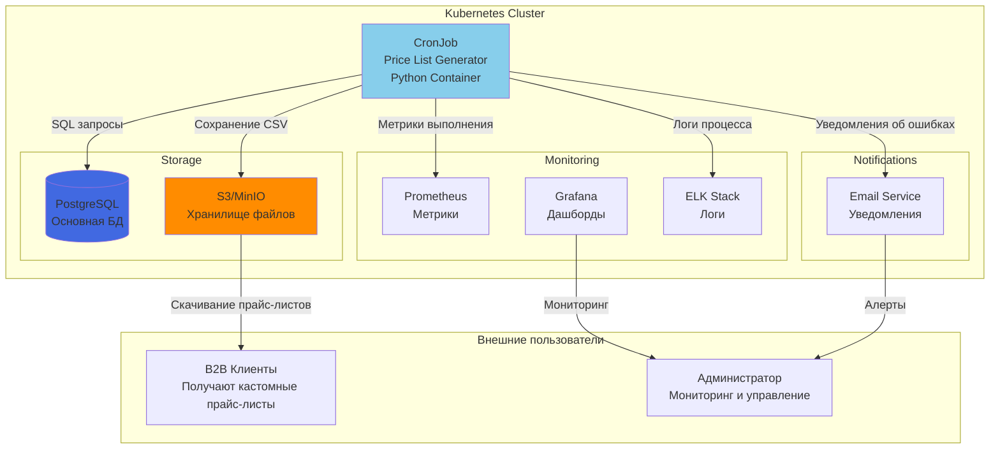
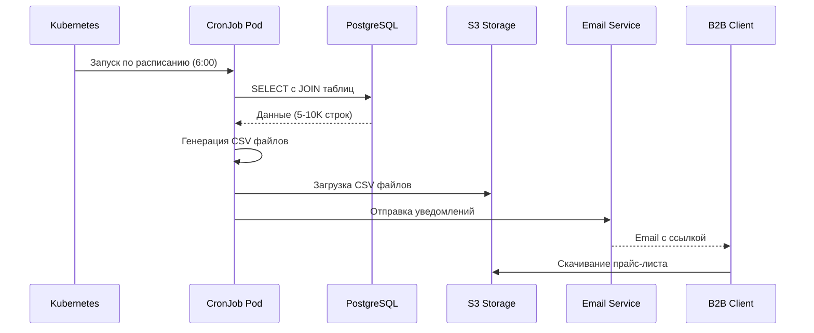

# C4 Диаграмма контекста системы (To Be)

## Context Diagram - Система генерации прайс-листов



## Архитектура решения

### Компоненты системы

#### 1. **CronJob (Price List Generator)**
- **Технология**: Python 3.11 в Docker контейнере
- **Расписание**: "0 6 * * *" (каждый день в 6:00)
- **Ресурсы**:
  - CPU: 100m-500m
  - Memory: 128Mi-512Mi
- **Функции**:
  - Подключение к PostgreSQL
  - Выполнение SQL запроса с JOIN
  - Генерация CSV файлов
  - Загрузка в S3/MinIO
  - Отправка уведомлений

#### 2. **PostgreSQL Database**
- **Версия**: PostgreSQL 15
- **Deployment**: StatefulSet или managed service
- **Таблицы**:
  - products (5-10K записей)
  - categories (50-200 записей)
  - clients (100-500 записей)
  - client_prices (10-20K записей)

#### 3. **S3/MinIO Storage**
- **Назначение**: Хранение сгенерированных прайс-листов
- **Структура**: `/price-lists/{client_id}/{date}/price_list.csv`
- **Retention**: 30 дней
- **Доступ**: Presigned URLs для B2B клиентов

#### 4. **Monitoring Stack**
- **Prometheus**: Сбор метрик (время выполнения, статус, размер файлов)
- **Grafana**: Визуализация метрик и алерты
- **ELK**: Централизованное логирование

### Поток данных (Workflow)



### Обработка ошибок

```yaml
spec:
  backoffLimit: 3  # Количество попыток
  activeDeadlineSeconds: 3600  # Максимальное время выполнения
  successfulJobsHistoryLimit: 3
  failedJobsHistoryLimit: 3
```

### Мониторинг и алерты

**Метрики Prometheus:**
- `cronjob_execution_duration_seconds` - Время выполнения
- `cronjob_rows_processed_total` - Количество обработанных строк
- `cronjob_files_generated_total` - Количество файлов
- `cronjob_failures_total` - Количество ошибок

**Алерты:**
- Job не выполнился 2 дня подряд
- Время выполнения > 30 минут
- Размер файла < 1KB (пустой файл)
- База данных недоступна

### Преимущества архитектуры To Be

1. **Простота**: Минимальное количество компонентов
2. **Надежность**: Встроенные retry механизмы K8s
3. **Масштабируемость**: Легко увеличить ресурсы
4. **Observability**: Полная интеграция с K8s мониторингом
5. **Cost-effective**: Ресурсы используются только во время выполнения
6. **Cloud-native**: Готово к deployment в любом K8s кластере