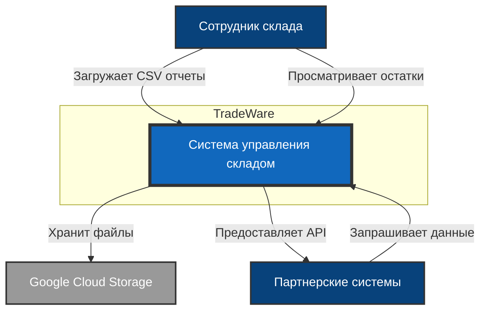
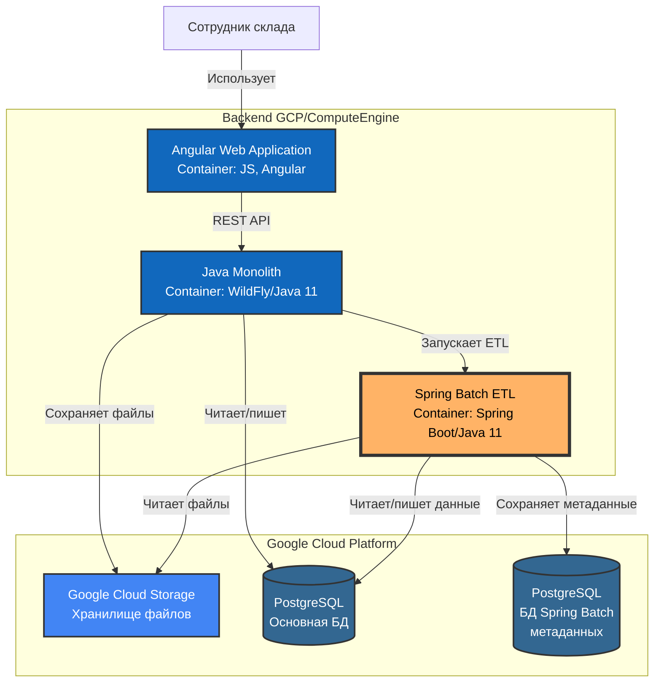
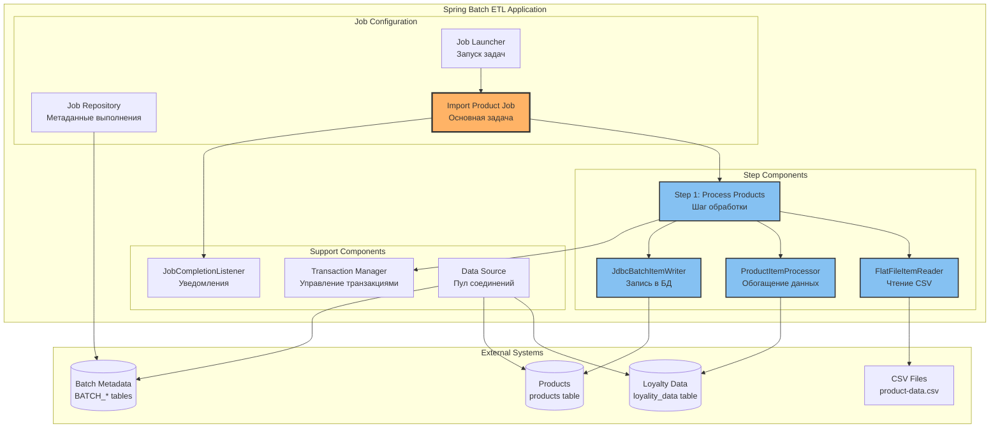
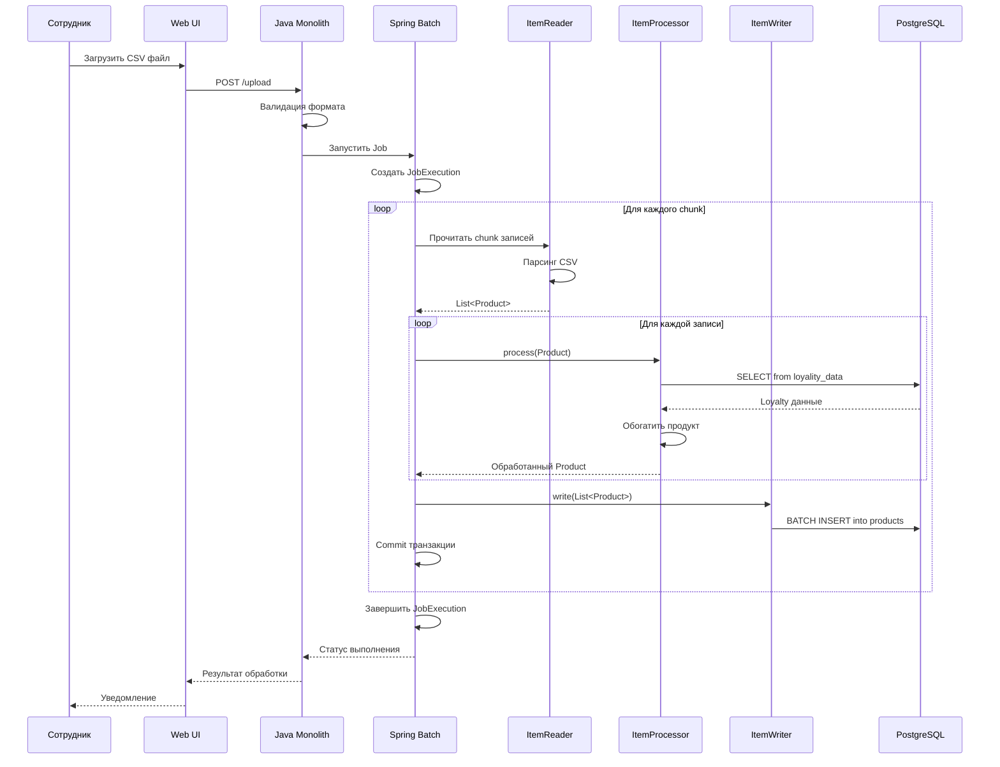
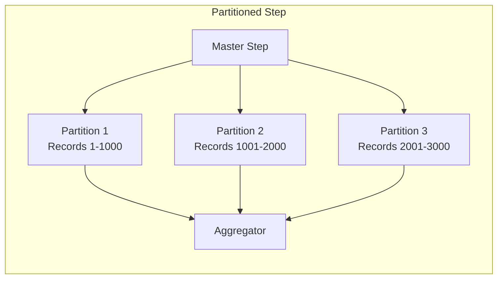
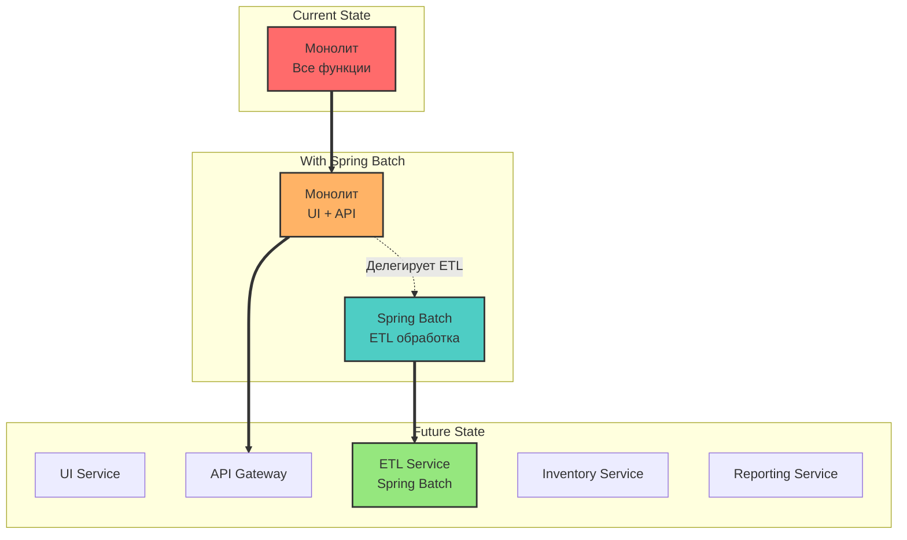
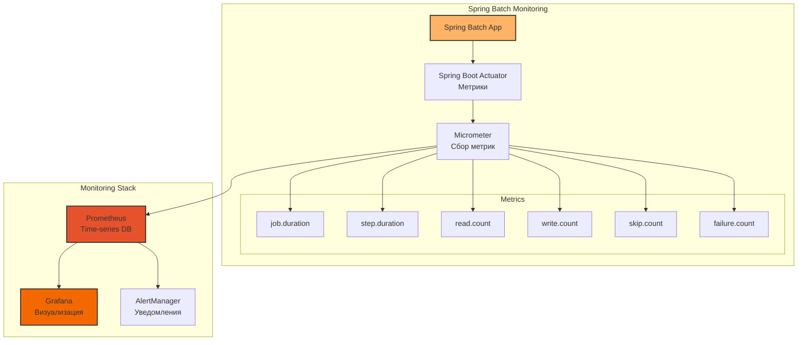

# C4 Диаграммы архитектуры с Spring Batch

## Уровень 1: Контекст системы (System Context)

## Уровень 2: Контейнеры (Container Diagram)

## Уровень 3: Компоненты Spring Batch (Component Diagram)

## Уровень 4: Последовательность обработки (Sequence Diagram)

## Архитектурные решения

### 1. Chunk-Oriented Processing
- **Размер chunk**: 100-500 записей (настраивается)
- **Преимущества**: Оптимальное использование памяти, транзакционность на уровне chunk
- **Restart**: При сбое обработка продолжается с последнего успешного chunk

### 2. Параллельная обработка

### 3. Интеграция с существующей системой

### 4. Мониторинг и метрики

## Потоки данных

### Основной ETL поток
1. **Загрузка файла** → GCS
2. **Запуск Job** → Spring Batch
3. **Чтение CSV** → ItemReader
4. **Обогащение** → ItemProcessor + Loyalty DB
5. **Запись** → ItemWriter + Products DB
6. **Уведомление** → JobCompletionListener

### Поток при ошибке
1. **Обнаружение ошибки** → Exception в процессоре
2. **Skip Policy** → Пропуск проблемной записи
3. **Retry Policy** → Повторная попытка (3 раза)
4. **Rollback** → Откат транзакции chunk
5. **Логирование** → Запись в error_log
6. **Продолжение** → Обработка следующего chunk

## Выводы

Архитектура с Spring Batch обеспечивает:
- ✅ Надежную обработку больших объемов данных
- ✅ Возможность горизонтального масштабирования через партиционирование
- ✅ Механизмы восстановления после сбоев
- ✅ Интеграцию с существующей Java инфраструктурой
- ✅ Путь миграции к микросервисной архитектуре
- ✅ Полный мониторинг и observability