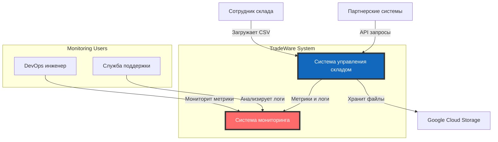
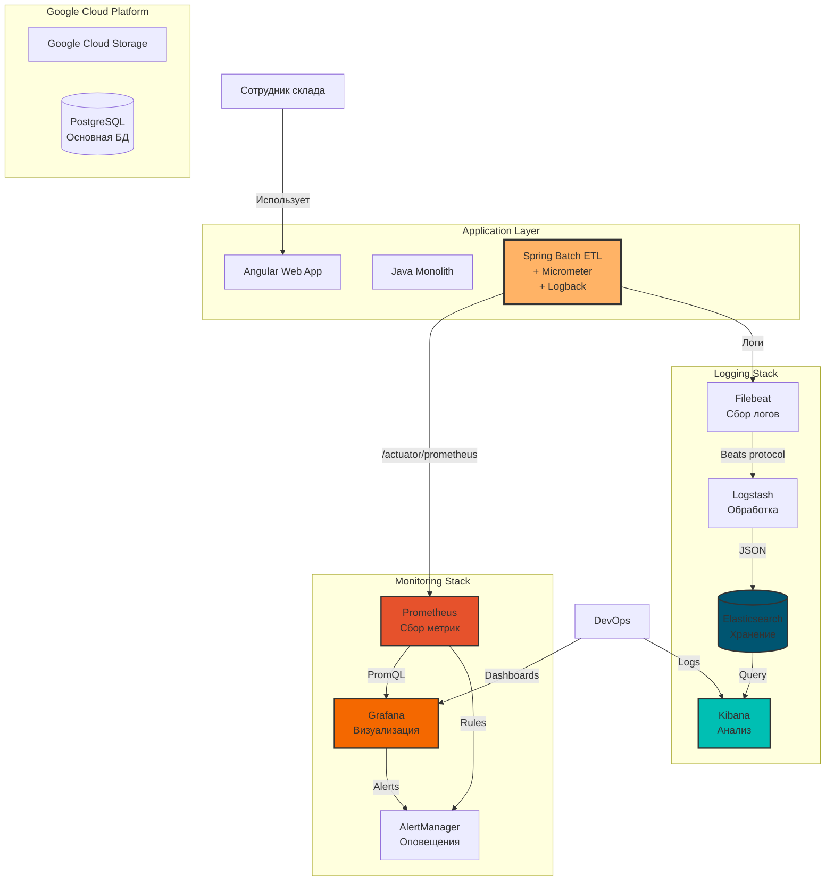
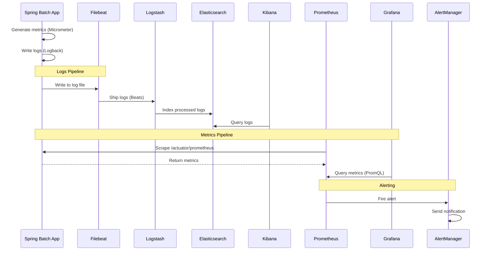

# C4 Диаграммы архитектуры с мониторингом и логированием

## Обновленная архитектура TradeWare с Observability Stack

### Уровень 1: Контекст системы с мониторингом



### Уровень 2: Контейнеры с Observability Stack



### Уровень 3: Компоненты Spring Batch с мониторингом

```mermaid
graph TB
    subgraph "Spring Batch Application"
        subgraph "Core Components"
            Job[Import Product Job]
            Step[Process Step]
            Reader[CSV Reader]
            Processor[Item Processor]
            Writer[DB Writer]
        end

        subgraph "Observability"
            Metrics[Micrometer Metrics<br/>- Job duration<br/>- Step execution<br/>- Items processed]
            Logs[Logback Appender<br/>- JSON format<br/>- Correlation ID<br/>- MDC context]
            Health[Health Endpoints<br/>- /health<br/>- /info<br/>- /metrics]
        end
    end

    subgraph "Metrics Collection"
        ActuatorEndpoint[/actuator/prometheus]
        PrometheusServer[Prometheus Server<br/>:9090]
        GrafanaDash[Grafana Dashboard<br/>:3000]
    end

    subgraph "Logs Pipeline"
        LogFile[Application Logs<br/>/var/log/app.log]
        FilebeatAgent[Filebeat Agent]
        LogstashPipeline[Logstash Pipeline<br/>:5044]
        ElasticIndex[Elasticsearch Index<br/>:9200]
    end

    Job --> Metrics
    Step --> Metrics
    Processor --> Logs

    Metrics --> ActuatorEndpoint
    ActuatorEndpoint -->|Pull| PrometheusServer
    PrometheusServer --> GrafanaDash

    Logs --> LogFile
    LogFile -->|Tail| FilebeatAgent
    FilebeatAgent --> LogstashPipeline
    LogstashPipeline --> ElasticIndex

    style Metrics fill:#FFD93D,stroke:#333,stroke-width:2px
    style Logs fill:#6BCB77,stroke:#333,stroke-width:2px
    style PrometheusServer fill:#E6522C,stroke:#333,stroke-width:2px
    style ElasticIndex fill:#005571,stroke:#333,stroke-width:2px
```

### Поток данных мониторинга



## Ключевые метрики для мониторинга

### Business Metrics (Spring Batch)
```yaml
# Job метрики
- spring_batch_job_duration_seconds
- spring_batch_job_status_total
- spring_batch_job_failed_total

# Step метрики
- spring_batch_step_duration_seconds
- spring_batch_step_read_count_total
- spring_batch_step_write_count_total
- spring_batch_step_skip_count_total

# Item processing метрики
- spring_batch_item_process_duration_seconds
- spring_batch_item_process_errors_total
```

### System Metrics (JVM)
```yaml
# Memory
- jvm_memory_used_bytes
- jvm_memory_max_bytes
- jvm_gc_pause_seconds

# Threads
- jvm_threads_live
- jvm_threads_peak
- jvm_threads_daemon

# Database
- hikaricp_connections_active
- hikaricp_connections_pending
- jdbc_query_duration_seconds
```

### Infrastructure Metrics
```yaml
# Container
- container_cpu_usage_seconds_total
- container_memory_usage_bytes
- container_network_receive_bytes_total

# Application
- up (availability)
- process_uptime_seconds
- http_server_requests_seconds
```

## Логирование

### Структура логов
```json
{
  "@timestamp": "2025-09-22T10:15:00.000Z",
  "level": "INFO",
  "service": "spring-batch-etl",
  "trace_id": "abc123def456",
  "span_id": "789ghi012",
  "job_id": "importProductJob",
  "step": "processStep",
  "message": "Processing product",
  "product_id": 12345,
  "product_sku": 20001,
  "duration_ms": 25,
  "host": "batch-app-1",
  "environment": "production"
}
```

### Log Levels Strategy
- **ERROR**: Job failures, database errors, critical issues
- **WARN**: Skipped items, retry attempts, degraded performance
- **INFO**: Job start/end, step execution, business events
- **DEBUG**: Item processing details, SQL queries
- **TRACE**: Method entry/exit, detailed diagnostics

## Алерты и оповещения

### Critical Alerts
1. **Job Failure Alert**
   - Condition: `spring_batch_job_failed_total > 0`
   - Severity: Critical
   - Action: Immediate investigation

2. **Processing Latency Alert**
   - Condition: `spring_batch_job_duration_seconds > 60`
   - Severity: Warning
   - Action: Performance review

3. **Database Connection Pool Alert**
   - Condition: `hikaricp_connections_pending > 5`
   - Severity: Warning
   - Action: Scale database

4. **Error Rate Alert**
   - Condition: `rate(spring_batch_item_process_errors_total[5m]) > 0.1`
   - Severity: Critical
   - Action: Check data quality

### Notification Channels
- Email: critical alerts
- Slack: all alerts
- PagerDuty: critical production issues

## Преимущества архитектуры

1. **Полная observability**: метрики + логи + трейсы
2. **Реактивный мониторинг**: автоматические алерты
3. **Историческийнализ**: долгосрочное хранение данных
4. **Масштабируемость**: горизонтальное масштабирование всех компонентов
5. **Отказоустойчивость**: независимые компоненты мониторинга